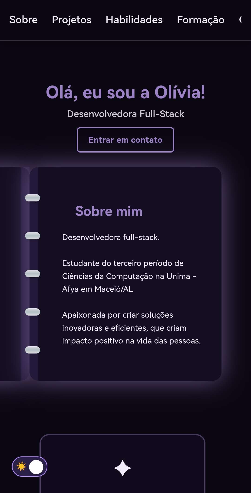

# Portifolio
[](https://git.io/typing-svg)

# ⊹₊˚‧︵‿₊୨ Meu Portfólio Pessoal ୧₊‿︵‧˚₊⊹

---

## 📌 Sobre o Projeto

Este é o meu portfólio pessoal, desenvolvido para centralizar meus projetos, habilidades e trajetórias no mundo do desenvolvimento fullstack. A ideia aqui é manter uma vitrine viva e em constante evolução da minha carreira técnica.

🔗 **Instância Oficial:** [Acesse o site aqui](https://oliviadev.vercel.app/)

---

## 💻 Tecnologias Utilizadas

⟡ HTML
⟡ CSS
⟡ JavaScript

---

## 𖦹 Demonstração

> **Note**

###| Desktop Preview | Mobile Version |

 | 

---

## 📂 Estrutura de Arquivos

Para manter o código organizado, a estrutura do projeto segue este padrão:

```text
├── assets/          # Imagens, prints e ícones
├── css/             # Arquivos de estilização (style.css)
├── js/              # Scripts e lógica (main.js)
├── index.html       # Página principal
└── README.md        # Documentação do projeto