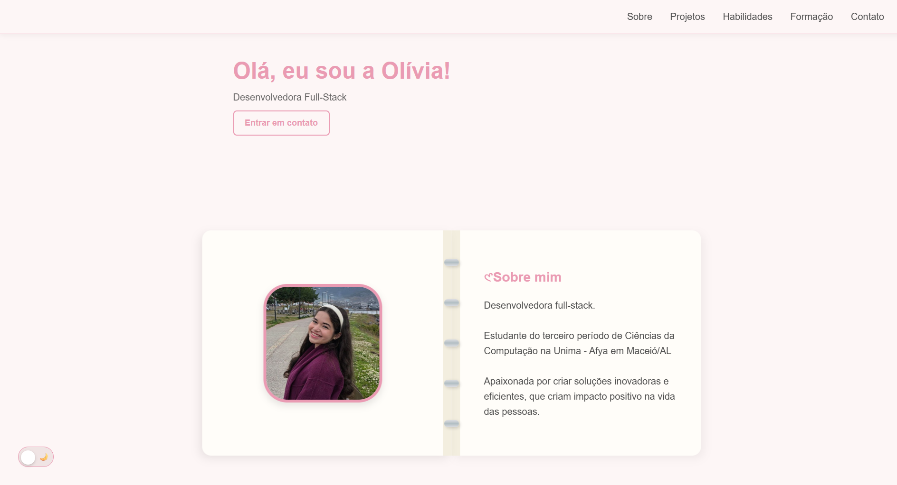
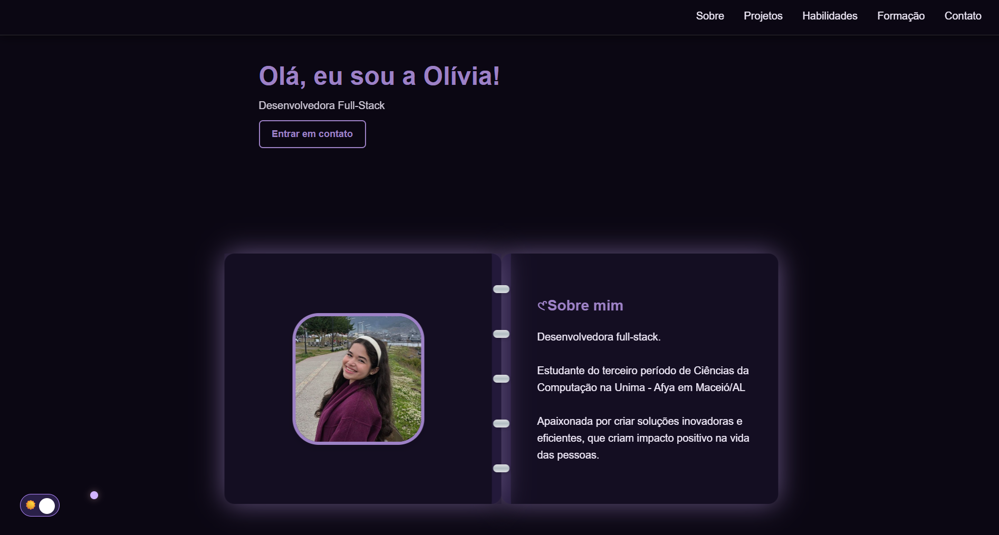

# Portfolio Pessoal


[](https://git.io/typing-svg)

<br>
<br>
<br>

#   ⊹₊˚‧︵‿₊୨ Meu Portfólio Pessoal ୧₊‿︵‧˚₊⊹

<br>

---

<br>

## 📌 Sobre o Projeto

Este é o meu portfólio pessoal, desenvolvido para centralizar meus projetos, habilidades e trajetórias no mundo do desenvolvimento fullstack. A ideia aqui é manter uma vitrine viva e em constante evolução da minha carreira técnica.  

<br>

🔗 **Link:** [Acesse o site aqui](https://oliviadev.vercel.app/)

<br>

---

<br>

## 𐙚 Tecnologias Utilizadas

⟡ HTML  
⟡ CSS  
⟡ JavaScript  

<br>

---

<br>

## 𖦹 Demonstração

<br>

### | Light Version | Dark Version |

<br>

  


<br>

---

<br>

## 📂 Estrutura do projeto

Para manter o código organizado, a estrutura do projeto segue este padrão:

```text
├── assets/          # Imagens, prints e ícones
├── css/             # Arquivos de estilização (style.css)
├── js/              # Scripts e lógica (main.js)
├── index.html       # Página principal
└── README.md        # Documentação do projeto